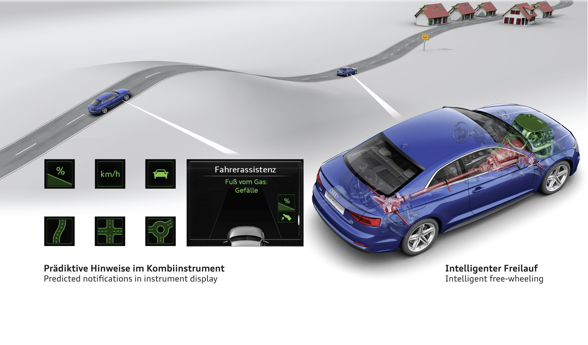
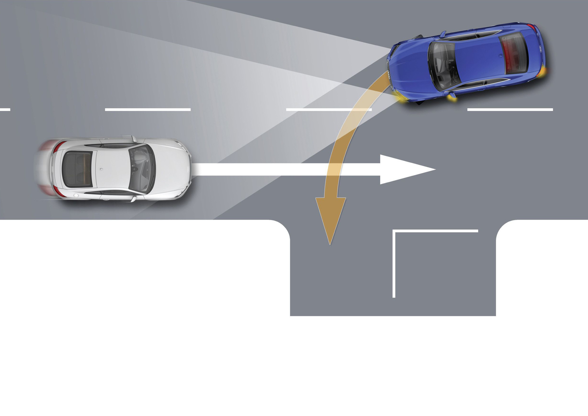
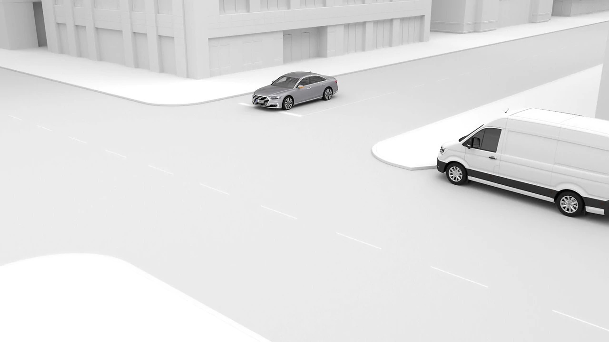
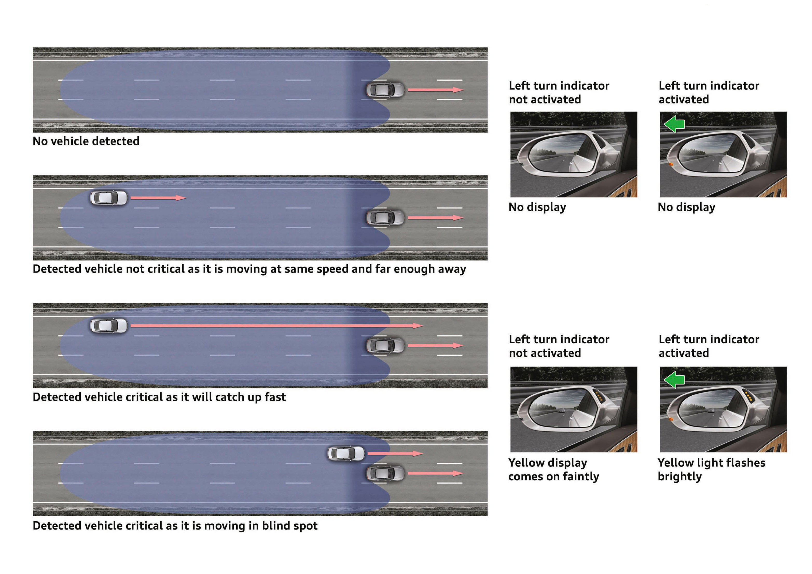
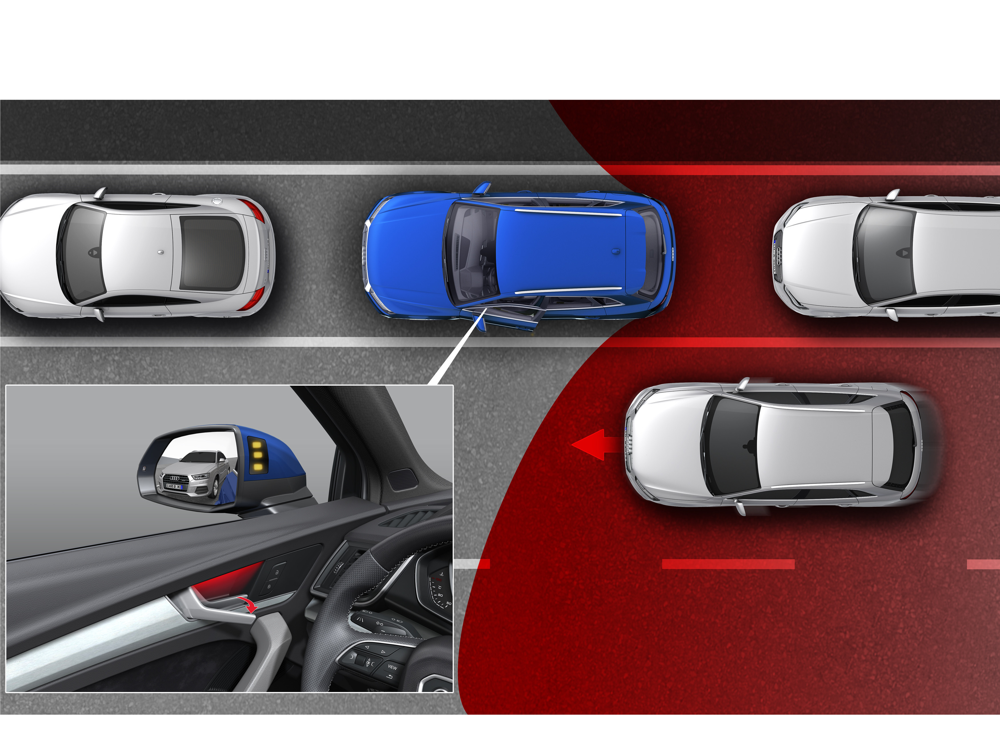
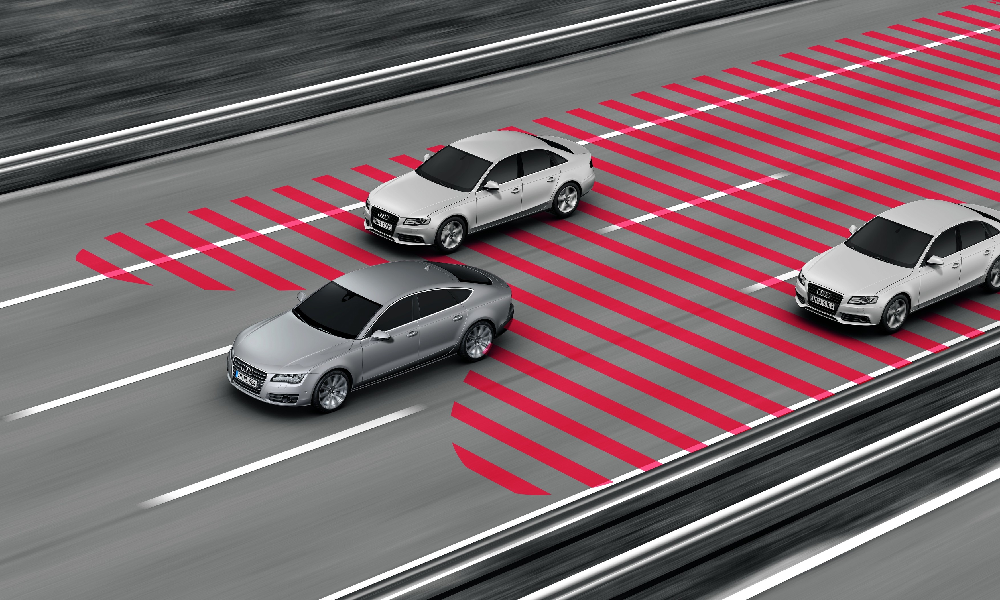

## Standard driver assistance

The following driver assistance system are standard equipment on Audi e-tron

### Hold assist

Hold assist enables convenient drive-offs when the car is on the usual inclines and descents of street traffic, and it prevents the vehicle from rolling. The system automatically switches over to the electromechanical parking brake when the car is stopped for a longer period of time while hold assist is activated. This ensures that the car will remain stationary even without activation of the parking brake. After a stop at a traffic light, for instance, the car drives off as soon as the driver presses the accelerator pedal. The system is activated in MMI

### Audi pre sense basic

Audi pre sense basic initiates preventive safety measures for occupants as soon as it recognizes a critical driving state. It utilizes information from various vehicle systems to determine this. For instance, it intervenes if the Electronic Stabilization Control (ESC) sensors detect skidding or hard braking. Then the system pretensions the seat belts of the driver and front passenger electrically to reduce their forward or lateral movements. The side windows and sliding sunroof are automatically closed. In addition, the hazard warning lights are activated to alert following traffic.

### Cruise control

Cruise control maintains a desired driving speed constantly starting at around 30 km/h (18.6 mph) (model dependent), provided that it can be maintained by engine power and engine braking effects. The system offers relief to drivers in this way – especially on long trips. At the same time, the constant speed mode of driving contributes towards lower fuel consumption and lower CO2 emissions. The system is operated via a separate steering column stalk, and the preset driving speed is shown in the instrument cluster. The system is deactivated when the driver brakes.

### Parking system plus

Parking system plus informs the driver, visually and audibly, about obstacles in front of and behind the vehicle. The warnings are made when the distance to a detected object in the path of driving is less than 90 cm (35.4 in) – depending on the specific model – after the driver has engaged reverse gear and activated the system by pushing a button on the center console. Ultrasonic sensors inconspicuously integrated into the bumpers measure the distance. The MMI display depicts it visually. A white segment shows a detected object outside of the driving path. Red segments represent detected objects within the driving path. The virtual driving path display also shows lateral guide lines which are precalculated based on the currently selected steering input and thereby assists in convenient parking and exiting. Increasing frequency of the audible warning indicates that the distance to the obstacle is decreasing. At around 30 cm (11.8 in) distance to the detected object, the driver hears a constant tone – the signal to stop.

### Audi active lane assist

Operating at speeds from 65 km/h (40.4 mph), Audi active lane assist helps the driver keep the vehicle in the driving lane. A camera detects lane lines and the track that the car is following between them. In this process, the camera can distinguish between yellow lines in construction zones and standard white markings. If the car approaches a line without the turn signal being activated, the system helps the driver to steer back into the lane by means of gentle but noticeable interventions in the electromechanical power steering. In the MMI system, the driver sets how early the control intervention should occur. In the case of an early steering intervention point, the system guides the driver towards the middle of the lane by gentle, centering steering interventions. With a late steering intervention point, Audi active lane assist does not intervene until shortly before the detected lane marking might be crossed; then it gives a corrective steering intervention in the proper direction. In addition, the driver may choose to be warned by a vibration of the steering wheel when crossing detected lane markings.

The Active Lane Assist can be disabled on the button at the end of the direction handle. It is not possible to permanent disable it.

### Speed limiter

The configurable speed limiter limits driving speed to a value set by the driver within the speed range of 30 to 250 km/h (18.6 to 155.3 mph) – which is very helpful within city limits or construction zones, for example. When the preset limit is reached, the vehicle gently throttles the speed down. The speed limit is not exceeded even if the driver applies more pressure to the accelerator pedal. However, the driver can temporarily override the limit by kick-down, and the speed limiter can be completely deactivated at any time from the steering column stalk. The speed that has been preset is shown in the instrument cluster.

## Tour driver assistance package

The following driver assistance systems are part of the tour driver assistance package with option id **PCC**

## Adaptive cruise assist

The adaptive cruise assist is a combination of adaptive cruise control and active lane assist.

The adaptive cruise assist supports the driver in accelerating, braking, maintaining speed and distance
as well as in lane guidance.

This can increase driving comfort, especially on long journeys. The system recognizes lane markings, side structures, vehicles in adjacent lanes and several vehicles in front within the framework of system limits. From this information, the system derives a virtual driving path and does it
Vehicle in this.

With an assisting steering intervention, the system helps to keep the vehicle permanently in the center of the lane. At the same time, the set speed is kept constant and the system reacts to vehicles in front with a distance control.

Thanks to the large number of parameters involved, the adaptive driving assistant offers the most comfortable possible driving in the speed range from 0 to a maximum of 250 km / h and in traffic jams. The adaptive driver assistant uses the radar sensor installed in the front of the vehicle, the front camera and the ultrasonic sensors to permanently monitor the area around the vehicle. The system is also supported by a steering wheel with handle recognition in a specific steering wheel design

### Adaptive cruise control with speed limiter.

The Adaptive cruise control (ACC) supports the driver by using the set within the system limits

Speed ​​and the distance to the vehicle in front. If a vehicle in front is detected, it can

System to brake or accelerate the vehicle within the system limits. Even in stop-and-go traffic and in
The system brakes traffic jams to a standstill and can be automated again depending on the duration of the downtime
approach.

Due to the large number of parameters involved, the adaptive speed assistant offers as much as possible
comfortable driving in the range from 0 to a maximum of 200 km / h. The system uses radar sensors and a front camera and the ultrasonic sensors to permanently monitor the vehicle's surroundings.

The included speed limiter helps not to exceed a previously set maximum speed when driving manually. The speed limiter operation can be temporarily deactivated via kick-down and the set maximum speed is exceeded. The function is available from approx. 30 km / h

[Cruise control handle](cruisecontrol.jpg "The cruise control handle controls the function. ")

You enable the cruise control with pressing the buttom at the end. Or you can resume earlier speed with pulling the lever.

Speed is adjusted with pushing the lever up and down. You can control the distance to the car in front with the distance button.
The lim button on top enable the speed limiter.

### (Predictive) efficiency assist

Efficiency assist helps the driver to drive preemptively and save energy. The system works closely together with adaptive cruise control (ACC) or adaptive cruise assist (ACA). It accesses predictive route data from navigation and Car-to-X information. 
In order to detect traffic signs and other vehicles, the efficiency assist uses the front camera as well as data from the front and rear-facing radar sensors.

The driver is shown corresponding information in the instrument cluster or in the Audi virtual cockpit and the head-up display as soon as it would be sensible to take the foot off the right-hand pedal. Symbols for speed limits, bends, roundabouts, towns, or downhill slopes that indicate to the driver to slow down are displayed on the basis of the route data and recognition of traffic signs. Depending on the model the gas pedal also pulses against the sole of the driver’s foot – a clear indication to take their foot off the gas.

If the cruise assist is switched on or the ACC is activated, efficiency assist regulates actively. It decelerates and accelerates predictively and adapts the speed to the course of the road and the traffic situation, also taking vehicles driving in front into account. If the driver so wishes, the system controls the freewheeling and coasting operation of the engine in cooperation with other control units. The predictive system always maintains a driving style that reflects the driving program selected – from efficient to sporty – and uses scope for recuperation in the Audi e-tron.

The driver can override the system at any time by accelerating and braking. In addition, drivers can individually activate, deactivate and configure many of their detailed functions in the MMI. Depending on the model, the control, for example, can be adapted to the course of the road in three stages: slow, medium or fast.

### Turn assist

Turn assist monitors the road lane with oncoming traffic by means of radar sensors, the front camera and, in certain models, a laser scanner. Monitoring is initiated as soon as the driver sets the turn signal. When driving off from a stop, or during slow driving up to a speed of 10 km/h (6.2 mph), the system can intervene by applying the brakes to prevent the car from colliding with an oncoming vehicle when turning left or right (country-dependent). This brake intervention keeps the vehicle within its own driving lane. The driver is informed of the intervention by an indicator in the instrument cluster.

### Collision avoidance assist

Collision avoidance assist helps the driver steer around an obstacle in a critical situation. The system uses data from the two radar sensors and the front camera for this purpose. In calculating a suitable evasive maneuver corridor, it takes into account the distance, width and offset of the vehicle driving ahead. Collision avoidance assist is available over a speed range from approx. 30 to 150 km/h (18.6 to 93.2 mph), and it assumes that the driver is actively steering throughout the maneuver. The driver is informed of the intervention by an indicator in the instrument cluster.

First, a jolt is produced to warn the driver of the hazard. If the driver then actively avoids the obstacle, the assistant applies a slight steering torque that helps by correcting the driver’s steering input or helping to make a lane change. Models like the Audi A8 (2017) use a specific braking of individual wheels – with it the vehicle is made to follow the computed course.

This is part of the tour package with option id PCC on Audi e-tron

### Traffic sign recognition

Camera-based traffic sign recognition detects traffic signs such as speed limit signs (including digital signs), no passing zones, entry restriction signs and other auxiliary signs, and it shows them to the driver in graphic form. They then appear in the driver information system and/or the Audi virtual cockpit as well as in the head-up display. The camera on the windshield also detects temporary speed restrictions such as in construction zones, as well as time- and weather-conditional restrictions. The system shows the currently applicable speed limit. For example, if a lower speed applies when the road is wet, this value is displayed – if the windshield wipers are on. Speed limits that are only in force at certain times of day are only shown at those times. In addition, the driver can choose a warning threshold as an offset to the legal speed limit. When this threshold is exceeded, a visual warning is given.

To turn of that predictive driver assist should follow sign this can be disabled here  MMI - > Car - > Driver Assist - > Adative Cruise Assist ->  Predictive Control -> Use speed limit -> Off

### Emergency assist

Emergency assist detects, within system limits, when the driver is inactive. In such a case, the system assumes control of the vehicle and automatically brakes it to a standstill in its own lane. Emergency assist monitors the driver’s steering activity. If it detects that the driver is inactive, it prompts the driver repeatedly, via visual and audible warnings and by brake jolts, to actively take over control of the vehicle again. With the first strong brake jolt at a driving speed below 80 km/h (49.7 mph), the hazard warning lights are also activated to warn the surrounding traffic. If the driver remains inactive, despite the warnings, Emergency assist brings the vehicle to a standstill within system limits. The parking brake is engaged. The driver can deactivate Emergency assist at any time by moving the steering wheel, pressing the brake or accelerator pedal or by shutting off active lane assist or adaptive cruise control.

## City assistance package

The following driver assistance system are part of the city assistance package with option id **PCM**

### Audi pre sense front / Audi pre sense city

Audi pre sense front and Audi pre sense city utilize the data of radar sensors and/or the front camera, depending on the car model, to compute the probability of a collision. Within the limitations of the system, it warns of collision threats and initiates braking at specific vehicle speeds. Vehicles are detected in the driving speed range of up to 250 km/h (155.3 mph), pedestrians up to around 65 km/h (40.4 mph) or 85 km/h (52.8 mph) depending on the model, as well as cyclists, depending on the system.

If a collision is imminent, the system warns the driver with visual, acoustic and haptic warnings based on a multistage warning concept. If necessary, the system provides braking assistance to reduce vehicle speed or initiates a full brake application to avoid the collision under certain circumstances. Actions are also taken to protect occupants. The hazard warning lights are activated, the seat belts are reversibly pretensioned, the seat position is optimized, and the windows and optional panoramic glass sunroof are closed.

### Audi side assist

The Audi side assist lane-changing assistant helps the driver to change lanes at driving speeds of 15 km/h (9.3 mph) and faster. It uses two rear-mounted radar sensors with a scanning range of roughly 70 meters (229.7 ft). If the system detects a vehicle located in the blind spot or approaching quickly from the rear, a warning LED is lit in the housing of the relevant exterior mirror. If the driver activates the turn signal anyway, the LED flashes several times in rapid succession.

### Exit warning

Exit warning improves safety in city traffic. If the car has come to a stop and other vehicles or bicyclists classified as critical are approaching from the rear, the system warns passengers not to open the doors. The system does this using LED lights in the door panels. In a situation assessed to be hazardous, the LEDs flicker and light red. The LEDs of Audi side assist are also lit in the relevant exterior side mirror. The exit warning remains active for approximately three minutes after the ignition is turned off.

This system is based on the radar sensors of Audi side assist, which monitor the zones behind the vehicle and to the sides at the rear. Depending on the model the exit warning is extended by an additional feature: If the system is active, opening of the electronic door locks is delayed roughly one second.

### Cross traffic assist rear

Cross traffic assist rear warns the driver of approaching vehicles it deems critical when slowly backing up, such as when pulling out of a perpendicular parking spot. It uses the rear radar sensors for this. They cover the zone at the rear, including the driving lanes to the left and right behind the vehicle. The warnings are progressive – initially a visual warning is shown in the MMI display (in the park assist display). The situation is represented in a virtual top view and in the “rear” and “rear side” camera views. Red arrows behind the vehicle point in the direction from which there is a potential hazard. If the driver does not react to the visual display, an audible signal sounds before the system warns the driver with a brake jolt. This helps to avoid accidents while exiting parking spaces.

### Audi pre sense rear

Audi pre sense rear uses radar sensors in the rear bumper to detect an impending rear-end collision, and it initiates preventive safety measures. These include pretensioning the front seat belts by electric power and closing the windows and sliding sunroof. In addition, the system activates the hazard warning lights to alert following traffic to the critical situation. In this process, the Rear-end collision alert signal (RECAS) is triggered, which flashes the hazard warning lights at a high frequency. Audi pre sense rear is active in background over the car’s entire driving speed range with the exception of trailer towing situations.

### Audi pre sense side

Audi pre sense side reacts in the event of a collision from the side. Amongst ohthers it uses the radar sensors of the crossing assist to calculate the probability of an accident involving traffic approaching from the side. The system can detect the threat of side collisions at speeds of up to approx. 60 km/h (37.3 mph) and apply preventative measures to help protect occupants. These include: activating the hazard lights, tensioning the safety belts, optimizing the seating position, and closing windows as well as the optional panoramic glass roof.

In an impending lateral collision at more than 25 km/h (15.5 mph), the suspension actuators of the optional Audi AI active suspension raise the body on the side exposed to the danger by up to 80 millimeters (3.1 in) within half a second. The other vehicle therefore hits the car in an even more impact-resistant zone. The side sills and floor structure accommodate a large portion of the impact forces. Deformation of the cabin and the loads acting on the occupants, above all to the chest and abdomen areas, are reduced by up to 50 percent compared with a lateral collision with no raising of the suspension.

## Other optional driver assystence systems

### Park assist

Park assist can automatically steer the car into parallel or perpendicular parking spaces. It uses ultrasonic sensors located in the front and rear bumpers and on the sides. The driver only has to accelerate, brake and shift gears.

The sensors measure parking spaces along the road while driving past them at moderate speed – a maximum of 20 km/h (12.4 mph) for perpendicular parking spaces and a maximum of 30 km/h (18.6 mph) for parallel spaces. A message appears on the MMI display when the system finds a suitable spot. The only actions required of the driver while parking are accelerating, shifting gears and braking. The system handles the steering. In addition, audible signals help the driver. Park assist will make multiple maneuvers, forwards and backwards, if necessary. It can also exit from parallel parking spaces. Depending on the model, the driver activates the system via either a button on the center console or a button in the lower infotainment display. The maximum speed for all maneuvers is 7 km/h (4.3 mph).

Park assist has option id **7X5** and is available as function on demand throug the myAudiApp

### 360 degree cameras

The four 360 degree cameras on the vehicle scan the immediate vicinity and display obstacles within. Drivers can choose from different views that simplify parking and maneuvering. A virtual overhead view shown in the MMI display gives the driver an overview of the overall parking situation. The panoramic view to the front and rear covers an angle of nearly 180 degrees and provides better visibility when exiting tight parking spaces, courtyard entrances and confusing intersections. Guide lines in the reversing camera view make it easier to park in perpendicular spaces and to hitch trailers. The view from the front camera helps when maneuvering, as it detects obstacles in front of the car. The system is automatically activated when driving in reverse or by pushing a button.

An additional feature for some models is a virtual 3D view. The driver can use the touchscreen to steplessly swivel and zoom the image of the car and the actual vehicle surroundings. There is also a view of the front or rear tires so that the driver can pull the car up right next to the curb.

### Curb warning

The curb warning identifies curbs that pose a risk to the tires or wheels. Prerequisite: The car is moving forward or backward at up to 10 km/h (6.2 mph). If the system detects a critical situation, it alerts the driver to this in the optical parking system display on the MMI monitor. To scan the surroundings the system uses primarily the 360 degree cameras.

### High-beam assist

High-beam assist utilizes a camera mounted on the interior mirror. It detects light sources – the headlights of oncoming vehicles, tail lights of other road users and the reflections of municipality limit signs, for instance – and automatically switches between high beam and low beam lighting. This provides for better visibility and a more relaxed driving experience. Drivers of oncoming vehicles are not blinded by glare. 

This is part of the HD-matrix lighning.

### Maneuvering assist

Maneuvering assist recognizes moving and stationary objects larger than 10 centimeters (3.9 in), such as a pillar in a parking garage or a moving vehicle. It helps to avoid impending collisions using warning steering impulses and by autonomously braking the car to a stop, provided that the car is traveling forward or in reverse at no more than 10 km/h (6.2 mph). The system uses the optical parking system in the MMI to display its steering and parking interventions. The surroundings are scanned using at least the ultrasonic sensors and the 360 degree cameras.

### Night vision assist

The night vision assist that Audi offers for multiple full-size models uses a far infrared camera. It reacts to the heat given off by objects. Converted to black and white images, the information can be viewed in the instrument cluster or Audi virtual cockpit. The cooler surroundings appear dark, while animals and people appear strikingly bright.

The system, which has a range of up to 300 meters (984.3 ft), can detect people and larger wild animals at distances between roughly 10 and 90 meters (32.8 and 295.3 ft) and highlights them with yellow markings. If a hazardous situation is detected, a warning sound is emitted. A warning symbol appears in the instrument cluster as well as in the head-up display. Depending on the headlights persons outside of town limits are illuminated with three short flashes of light.

### Reversing camera

The reversing camera simplifies maneuvering by showing the zone behind the vehicle on the MMI display. It shows the calculated driving track based on the steering angle as well as auxiliary lines and guide lines. For parallel parking, the latter lines precisely direct steering into the parking space in conjunction with steering reversal points. The blue pictured surface in the camera image indicates where the vehicle will be positioned after the parking procedure. The reversing camera is inconspicuously integrated into the handle trim strip of the luggage compartment lid. It is activated as soon as the driver engages reverse gear or pushes the respective button.

{}
