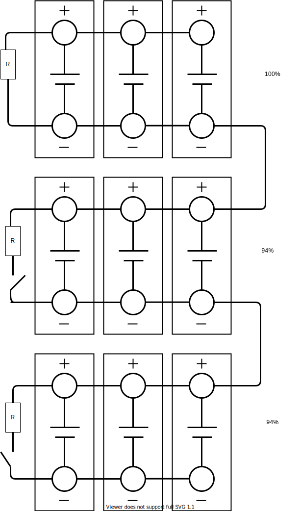

Cell balancing is needed when group of cells have higher or lower SOC than other group of cells.

In this example, the top group of cells is 100% charged and the charging procedure is complete.
However, the high-voltage battery charge level is only 96 %. Balancing means that this cell is now discharged via a resistor and can thereby continue to be charged until all cells have reached the same charge level. This allows the high-voltage battery to achieve its maximum capacitance.

To do this, the battery regulation control unit compares the voltages of the cell groups. If cell groups have a high cell voltage, the battery modules control unit responsible receives the balancing information. Balancing is performed when voltage differences of greater than approx. 1% occur when the high-voltage battery is being charged. After the ignition has been switched off, the battery regulation control unit checks whether balancing is necessary and triggers it if necessary. Typical balancing is performed at charge levels greater than 30%.

On all-electric Audis it is not possible to check the cell balance without extra tools. ODBEleven is one of these tools that can be used. The below screenshot show that one cell set has 10% SOC and another has 13% soc. Audi e-tron has 108 cell sets with 3 or 4 cells in parallel depending on version.

{}
